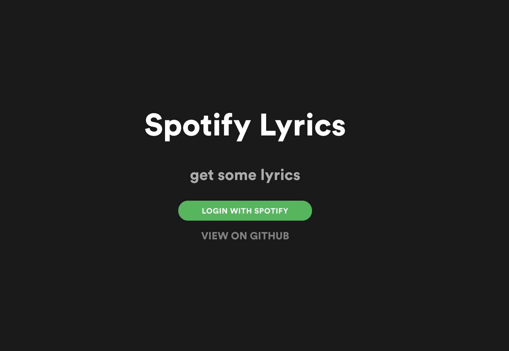
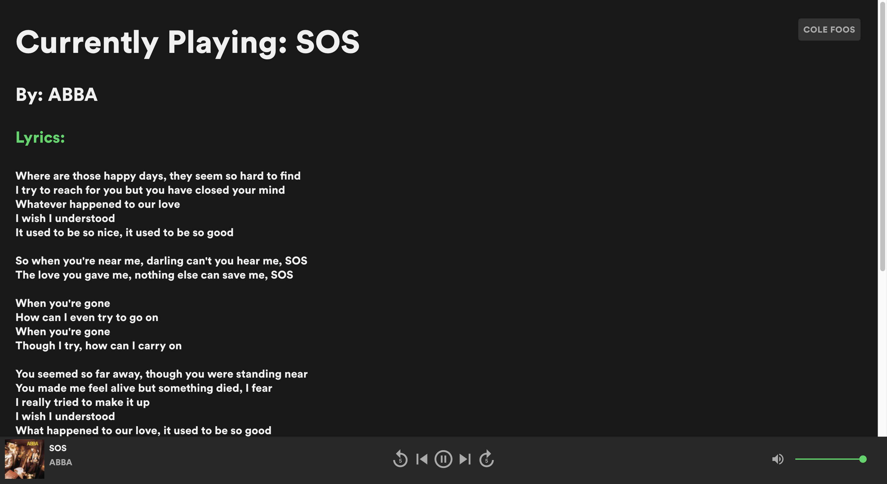

# Spotify-Lyrics-v2
a react app that uses spotify's web api to request user info and a serverless aws lambda function to grab the lyrics of the song.
http://spotify-lyrics.com/

the legacy spotify-lyrics is avaiable [here](https://github.com/foosiee/Spotify-Lyrics). it used a python-flask server to serve users.

thanks to [JMPerez](https://github.com/JMPerez) and [skovmand](https://github.com/skovmand) of [spotify-web-api-js](https://github.com/JMPerez/spotify-web-api-js) for the awesome typescript definitions for the spotify web api

## note
if you were to pull down this repo. You will need to add a .env file with your aws api gateway creds and add a config.js with your spotify application creds.

## login

## result

The player at the bottom of the screen is usable for Spotify premium subscribers.
